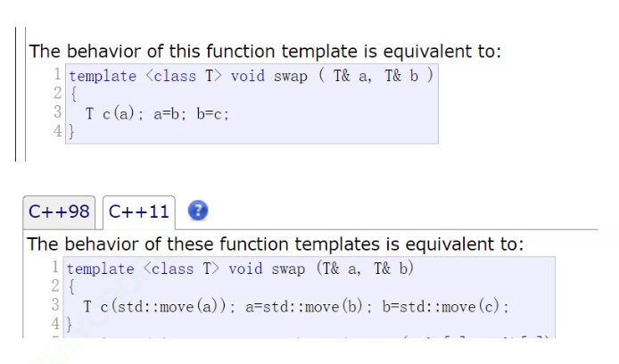
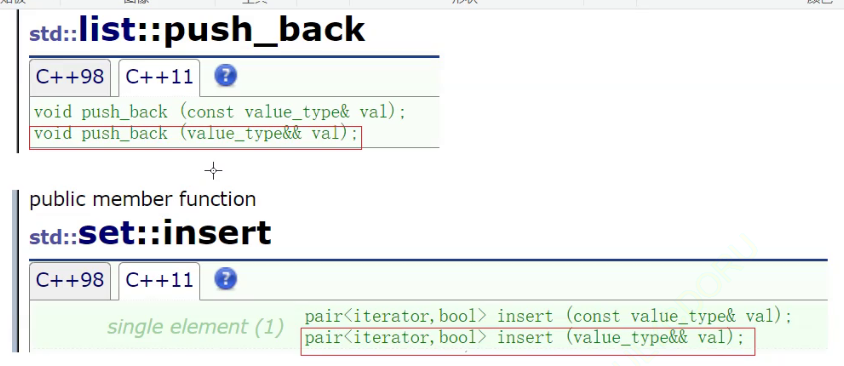
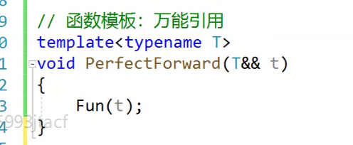
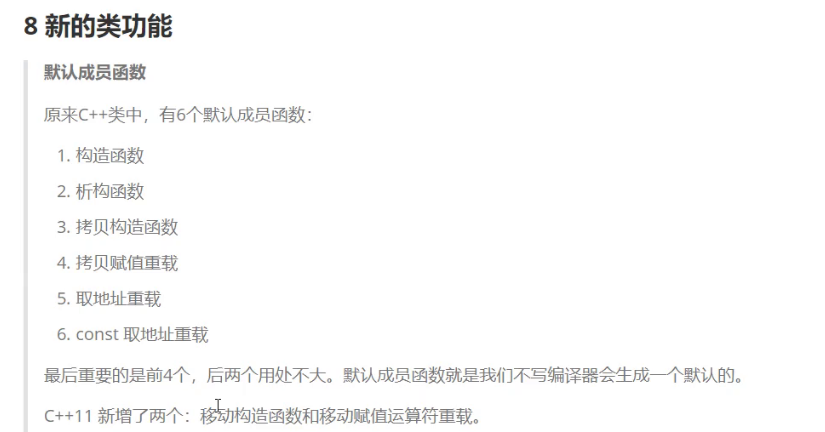

# C++ 11

## 列表初始化

```c++
int i=0;
int k={0};
int j{0};
```

等号可以加可以不加（省略赋值符号）


不推荐这样写，要能看懂

同时类也可以使用 {  }  初始化


这里转化为调用构造函数，理解为类型转换


###  std::initializer_list


**typeid(变量名).name()**  获取类型


用数组存下来，迭代器就是原生指针

也就可以使用迭代器遍历


```C++
 vector(initializer_list<T> l)
     {
         _start = new T[l.size()];
         _finish = _start + l.size();
         _endofstorage = _start + l.size();
         iterator vit = _start;
         typename initializer_list<T>::iterator lit = l.begin();//使用typename
     //在模板中使用嵌套类型名称时需要添加typename关键字
         while (lit != l.end())
         {
             *vit++ = *lit++;
         }
         //for (auto e : l)
         //   *vit++ = e;
     }

```

支持initializer_list的构造


同时使用范围for 进行插入  因为initializer_list也支持迭代器


先隐式类型转换为 一个个pair 然后再使用 initializer_list 初始化


也可以使用initializer_list 赋值


多参数的构造函数隐式类型的转换，如果参数个数不匹配则无法识别

## 声明

### auto


```C++
map<string, string> dict = { {"sort", "排序"}, {"insert", "插入"} };
//map<string, string>::iterator it = dict.begin();
auto it = dict.begin();

```

## decltype

将变量的类型声明为表达式指定的类型

```c++
// decltype的一些使用使用场景
template<class T1, class T2>
void F(T1 t1, T2 t2)
{
    decltype(t1 * t2) ret;
    cout << typeid(ret).name() << endl;
}
int main()
{
    const int x = 1;
    double y = 2.2;
    decltype(x * y) ret; // ret的类型是double
    decltype(&x) p;      // p的类型是int*
    cout << typeid(ret).name() << endl;
    cout << typeid(p).name() << endl;
    F(1, 'a');
    return 0;
}
```

typeid 只能以字符串类型获取到，但不能用于定义类型


auto不能用于作为类型传入容器


##  右值引用和移动语义

### 左值引用和右值引用

左值跟右值只是分类，不是代表它在那一边


左值也可能在右边


```c++
int main()
{
    // 以下的p、b、c、*p都是左值
    int* p = new int(0);
    int b = 1;
    const int c = 2;
    // 以下几个是对上面左值的左值引用
    int*& rp = p;
    int& rb = b;
    const int& rc = c;
    int& pvalue = *p;
    return 0;
}
```


右值不能被修改，不能取地址，左值可以被取地址


```c++
int main()
{
    double x = 1.1, y = 2.2;
    // 以下几个都是常见的右值
    10;
    x + y;
    fmin(x, y);
    // 以下几个都是对右值的右值引用
    int&& rr1 = 10;
    double&& rr2 = x + y;
    double&& rr3 = fmin(x, y);
    // 这里编译会报错：error C2106: “=”: 左操作数必须为左值
    10 = 1;
    x + y = 1;
    fmin(x, y) = 1;
    return 0;
}

```

**右值引用**

无法对右值取别名是因为权限放大(右值不能被修改，左值对其引用后们可以修改，这时候加上const （无法修改）就可以了)


move转化属性

### 引用返回


不能使用引用返回，因为内存已经被销毁了 

**右值分为 纯右值（内置类型右值）和将亡值 （自定义类型的右值）**


如果对于一个左值 move 后变为右值，如果实现了移动构造，就会导致原来资源被释放，

**返回局部对象**




返回局部对象，并进行深拷贝，消耗是很大的，效率很低，这时候使用移动赋值，移动构造就会减少很多消耗

C++98，为了减少拷贝，就只能传入一个一样对象引用


C++11  传值返回，使用移动构造，移动赋值就更符合直觉方便


move不是改变当前元素的属性，只是返回值右值属性

 



**右值被右值引用后，属性变成左值**


对于使用右值引用的函数内部都需要对赋值或者拷贝进行move处理


```C++
void push_back(T&& x)
{
    insert(end(), move(x));
}
```

## 万能引用



**取决于T            引用折叠**


**完美转发，保持t的属性**，不至于右值引用后被认为左值

**上面使用move转化为右值属性的也可以使用forward保持右值属性**

```C++
void push_back(T&& x)
{
    insert(end(), forward<T>(x));
}
```





delete  不让编译器生成实现


## 模板的可变参数


sizeof计算参数包有几个参数

### 解析参数包


**参数包的传参分为  第一个参数和后续的参数包总和**，参数包里可以有零个参数

利用编译器的编译特性解析

### 直接解析展开参数包


```C++
template <class T>
int PrintArg(T&& t)
{
	cout << t << " ";
	return 0;
}

//展开函数
template <class ...Args>
void ShowList(Args&&... args)
{
	// 要初始化arr，强行让解析参数包，参数包有一个参数，PrintArg就依次推演生成几个
	int arr[] = { PrintArg(args)... };
	cout << endl;
}
```

**没看懂**


## lambda表达式


```C++
int main()
{
    vector<Goods> v = { { "苹果", 2.1, 5 }, { "香蕉", 3, 4 }, { "橙子", 2.2, 3 }, { "菠萝", 1.5, 4 } };
    //sort(v.begin(), v.end(), ComparePriceLess());
    //sort(v.begin(), v.end(), ComparePriceGreater());

    //sort(v.begin(), v.end(), [](const Goods& g1, const Goods& g2)->bool {return g1._price < g2._price; });
    sort(v.begin(), v.end(), [](const Goods& g1, const Goods& g2) {return g1._price < g2._price; });
    sort(v.begin(), v.end(), [](const Goods& g1, const Goods& g2) {return g1._price > g2._price; });
    sort(v.begin(), v.end(), [](const Goods& g1, const Goods& g2) {return g1._evaluate < g2._evaluate; });
    sort(v.begin(), v.end(), [](const Goods& g1, const Goods& g2) {return g1._evaluate > g2._evaluate; });

    return 0;
}
```

**返回值编译器会自己推导**可以不写


lambda返回值的类型  每个lambda都在编译阶段变成类 重载 （）  的仿函数名字是  

**<lambda_uuid>**


lambda的底层就是仿函数

### 捕捉列表


```C++
int x = 0, y = 1;
cout << x << " " << y << endl;

auto f1 = [](int& r1, int& r2) {
    int tmp = r1;
    r1 = r2;
    r2 = tmp;
};
f1(x, y);

cout << x << " " << y << endl << endl;


cout << x << " " << y << endl;	cout << &x << ":" << &y << endl;

//值引用捕捉
auto f2 = [x, y]() mutable {
    cout << &x << ":" << &y << endl;

    int tmp = x;
    x = y;
    y = tmp;
};
f2();


//引用捕捉  不是取地址  想要捕捉地址，定义变量取到地址，再捕捉这个变量
auto f3 = [&x, &y]() {
    cout << &x << ":" << &y << endl;

    int tmp = x;
    x = y;
    y = tmp;
};

f3();
```

**mutable 使捕捉的对象可以被修改**  同时注意捕捉的说明

**传引用捕捉可以直接被修改，不用使用mutable**

```C++
int x = 0, y = 1, z = 2;

auto f1 = [=, &z]() {
z++;

cout << x << endl;
cout << y << endl;
cout << z << endl;
};

f1();
```


## 包装器


把可调用对象放到类里

```C++
// 包装器
void swap_func(int& r1, int& r2)
{
	int tmp = r1;
	r1 = r2;
	r2 = tmp;
}

struct Swap
{
	void operator()(int& r1, int& r2)
	{
		int tmp = r1;
		r1 = r2;
		r2 = tmp;
	}
};

int main()
{
	int x = 0, y = 1;
	cout << x << " " << y << endl;

	auto swaplambda = [](int& r1, int& r2) {
		int tmp = r1;
		r1 = r2;
		r2 = tmp;
	};

	function<void(int&, int&)> f1 = swap_func;
	f1(x, y);
	cout << x << " " << y << endl << endl;

	function<void(int&, int&)> f2 = Swap();
	f2(x, y);
	cout << x << " " << y << endl << endl;

	function<void(int&, int&)> f3 = swaplambda;
	f3(x, y);
	cout << x << " " << y << endl << endl;

	map<string, function<void(int&, int&)>> cmdOP = {
		{"函数指针", swap_func},
		{"仿函数", Swap()},
		{"lambda", swaplambda},
	};

	cmdOP["函数指针"](x, y);
	cout << x << " " << y << endl << endl;

	cmdOP["仿函数"](x, y);
	cout << x << " " << y << endl << endl;

	cmdOP["lambda"](x, y);
	cout << x << " " << y << endl << endl;

	return 0;
}
```

## bind


绑定
