# list

# 迭代器

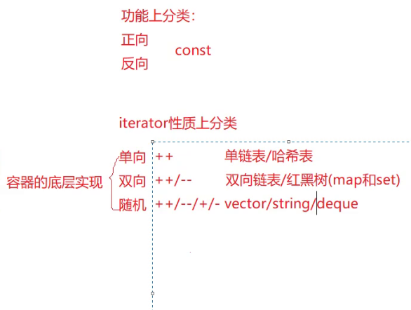

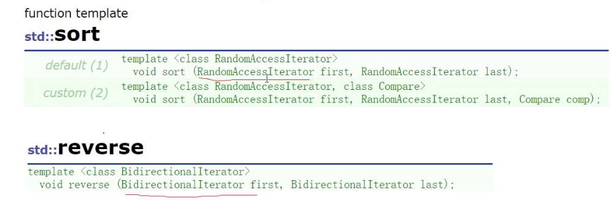

算法里的sort只是支持随机访问的迭代器，对于list  双向访问的迭代器可能会报错

所以list中会有sort函数 默认升序

reverse逆置函数

排序 sort

仿函数，

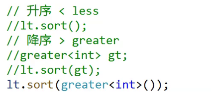

默认是升序，而对于降序，可以使用 greater 

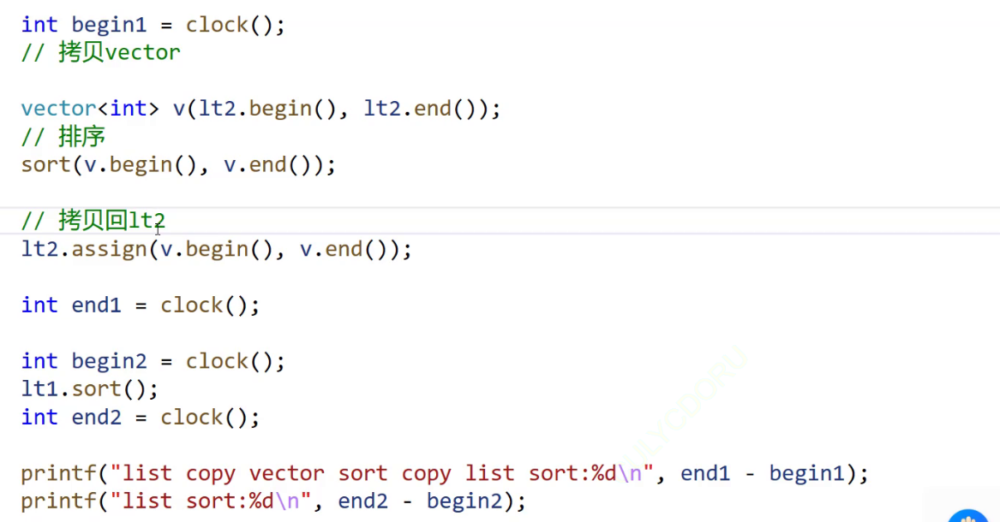

如果直接使用list的排序时间太长，我们可以将数据拷贝到vector，使用算法的sort ，如果list的数据量小，就可以使用list的sort

# merge

对于归并函数，两个链表需要有序

# splice

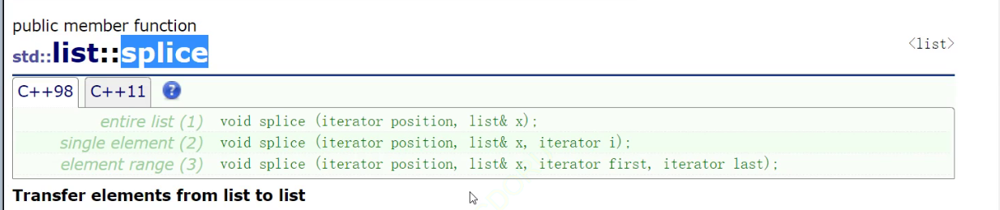

转移，将一个链表的一部分，转移到另外一个链表

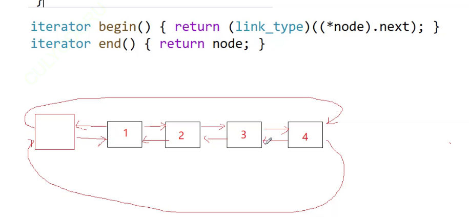

给匿名对象初始化防止编译器不通过

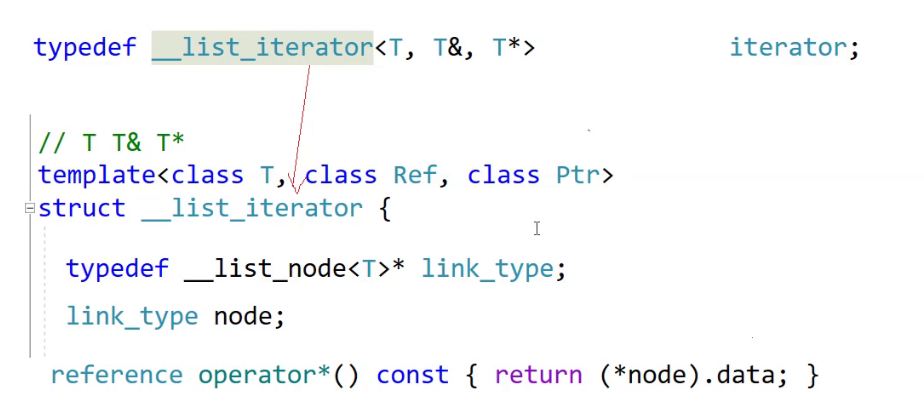

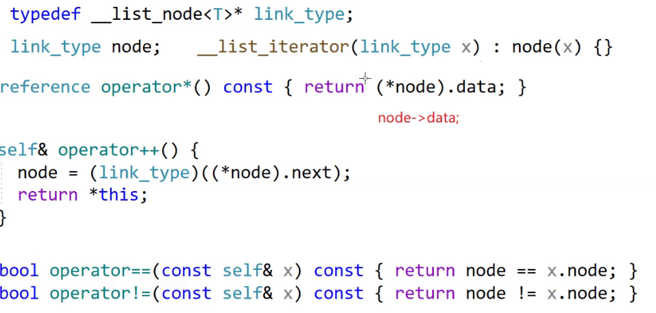

迭代器的作用

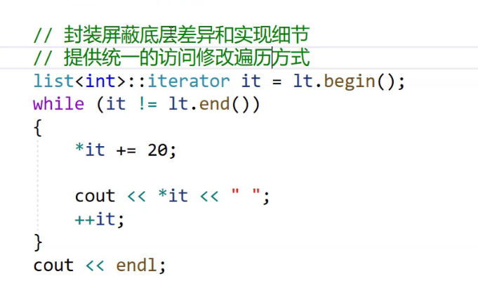

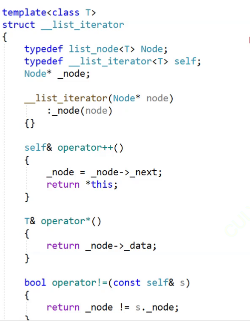

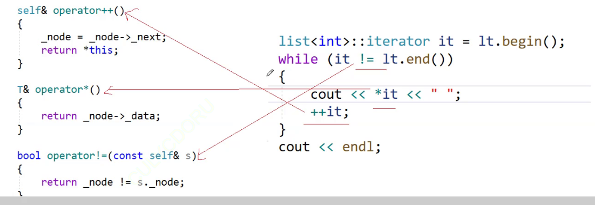

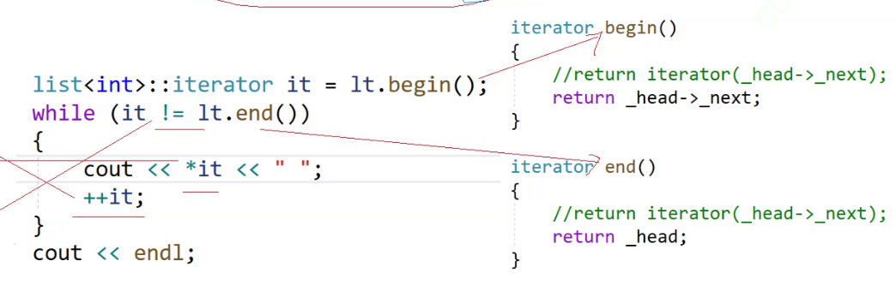

返回时强制转换（因为，迭代器就是对指针的模拟，也就是说，迭代器中模拟的行为都是指针可以实现的行为，这也就是强制转换不会丢失数据的原因）

对于自定义类型的流处理

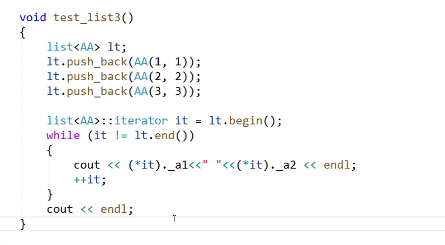

重载->

const_iterator

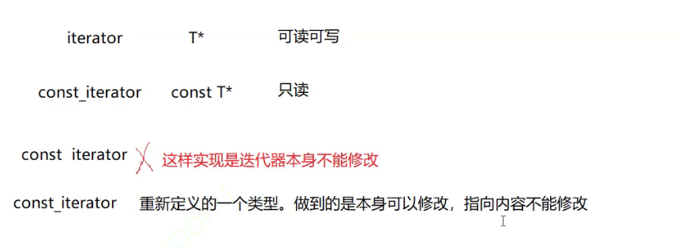

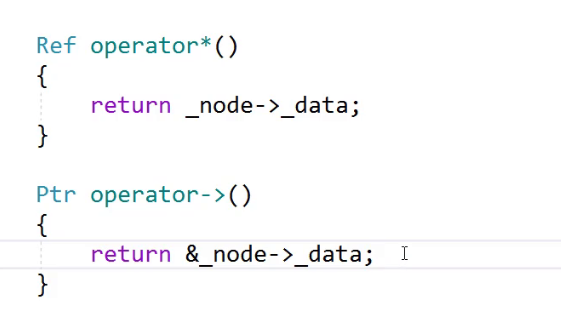

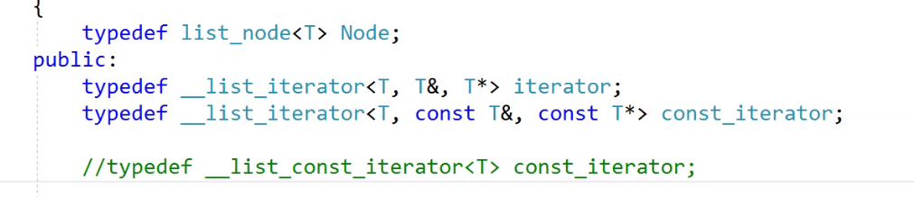

模板 typename class的区别

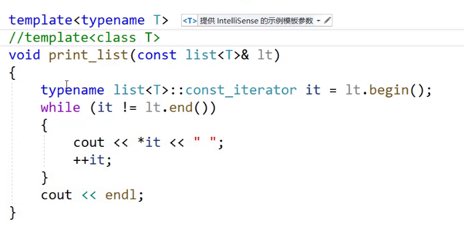

没有被实例化的类模板，编译器无法确定类：：后内部是什么，这时候需要typename

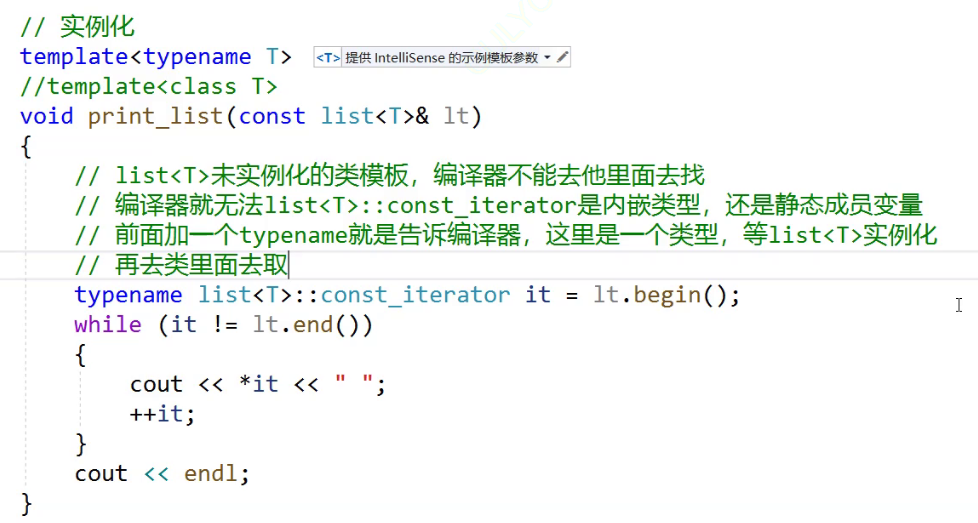

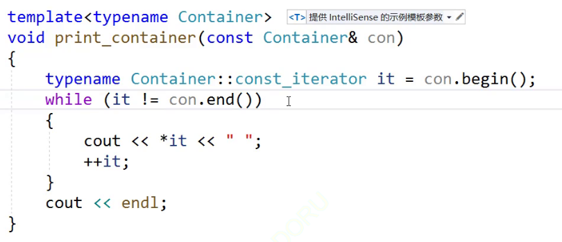

模板（泛型编程）本质，将我们需要编译的代码，交给编译器处理