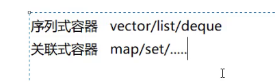
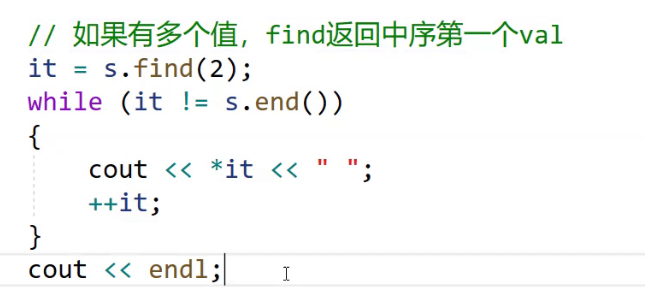

# map set 




	

insert 返回值 pair


对于erase 使用迭代器删除不存在的，将会报错，使用值删除没有报错

同时我们可以通过接收erase返回值判断是否正确删除

## lower_bound upper_bound


erase右是开区间

## equal_range


返回这个数存在的左右区间（左闭右开）

## count

也可以判断key在不在，


**set不支持修改**

# multiset


允许多个相同的key插入


## find



因为multiset允许存在多个相同的值，这时候，equal__range就可以一次性删除所有的val，count也可以在这里找到val右几个


同时可以通过接收erase的返回值判断删除几个val

```C++
size_t n=s.erase(2);
```

这些函数返回size_t的原因就是multiset存在多个相同的val，判断 

# map

key_value类型


## insert

```c++
map<string,string> m;
m.insert(pair<string,string> ("sort","排序"));
```


## nake_pair

函数模板


 

## iterator


但是这时候是深拷贝，消耗较大

使用&就不用拷贝了


## [ ]（重要）


传入key 返回value的引用


# multi_map

就是允许键值冗余


也不支持[]  因为key可能会一样


pair支持sort


但是比较方式是比较一个小就小


写仿函数来获取自己需要的比较方式

##  稳定排序库函数


sort不稳定


两个数据类型相同就可以使用迭代器区间初始化

## set的作用：排序+去重


自动备份，自动同步


