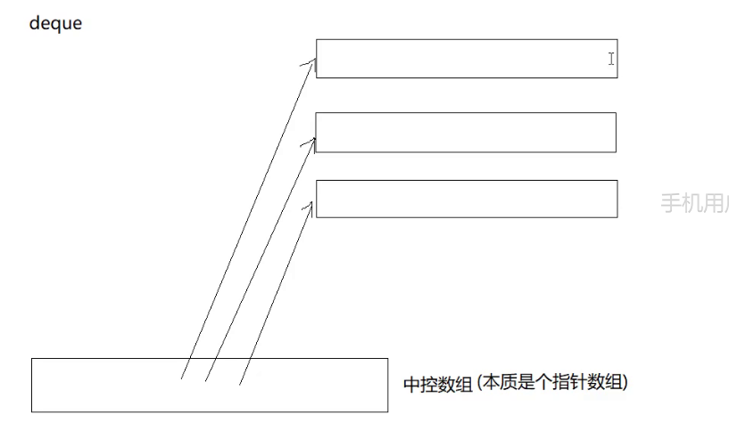

最小栈


当后面插入值小于等于时，就进行栈的插入


逆波兰表达式


## stack


两个模板参数

```C++
template<class T,class Container>
```

Container 适配器

可以使用不同的数据类型 比如vector list 都可以实现


提供这些接口即可


deque 双端队列 不是队列，只是普通容器 





assign   赋值，可以使用迭代器


deque可以使用库里的sort 阴天他的迭代器被分类成随机访问跌打去 redom iterator  

deque 在实现stack和queue上，比vector list更好的 头尾插入删除的性能更强，但其他的更能性能并不行

