# string 模拟实现

编写文字的编码

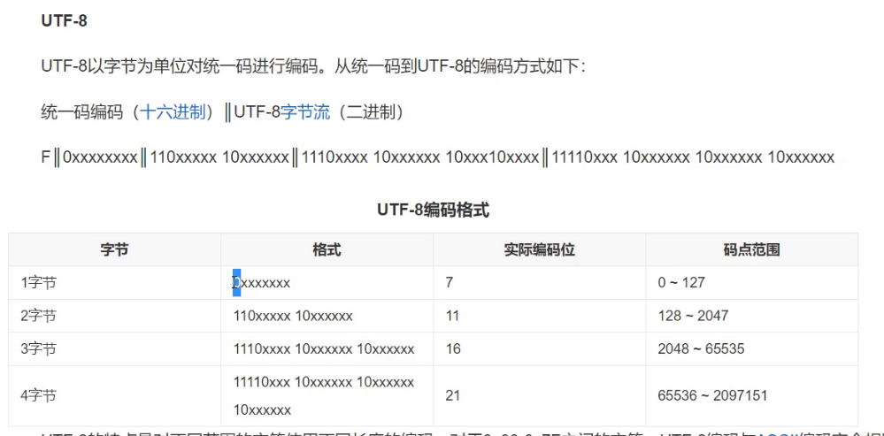

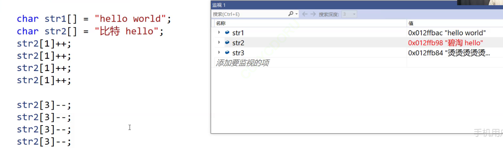

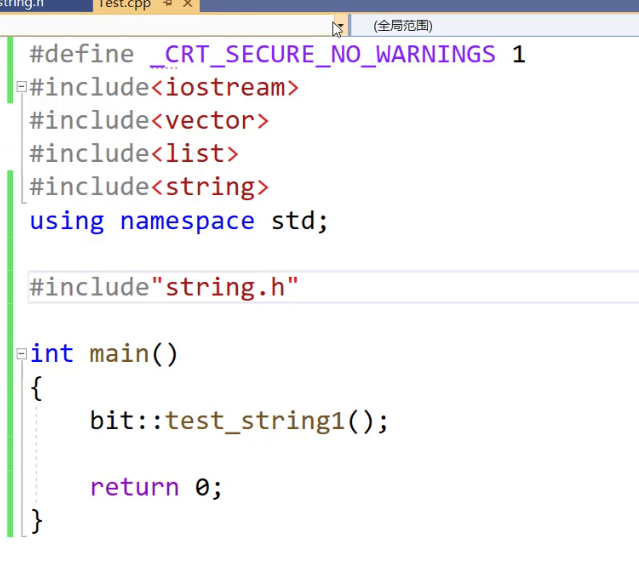

头文件展开

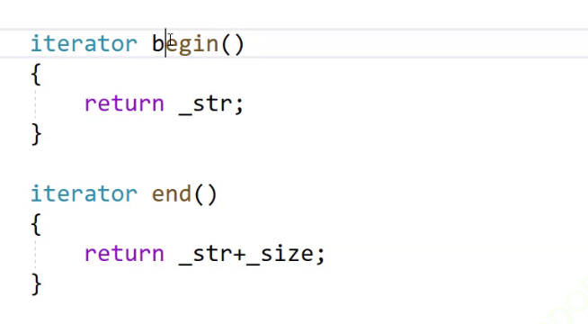

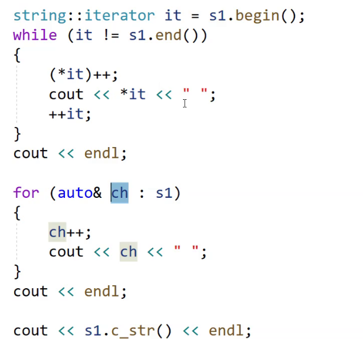

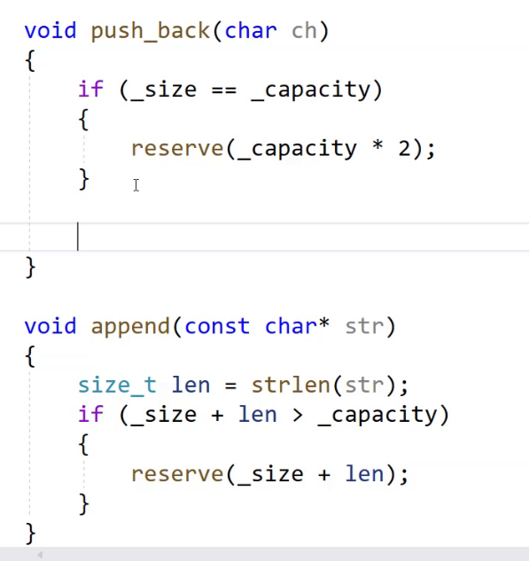

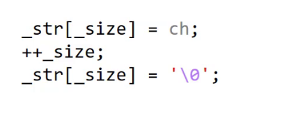

 

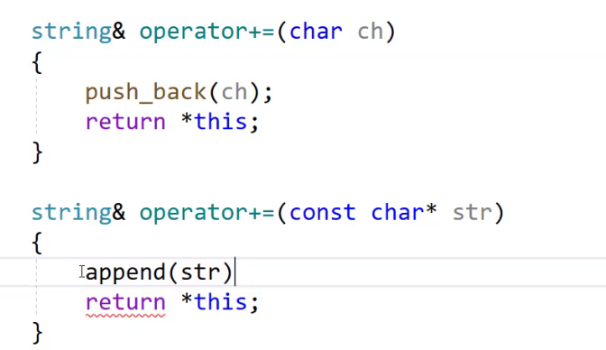

静态变量

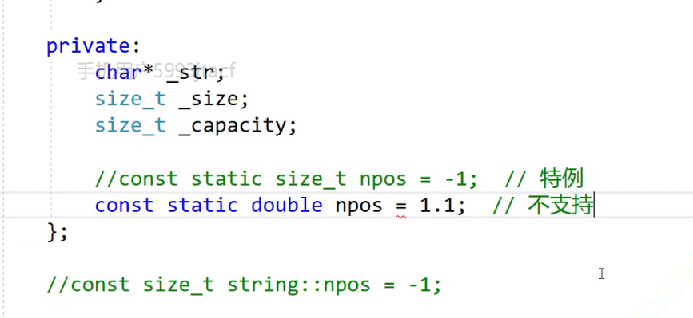

只有无符号整型可以

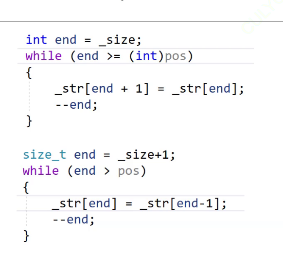

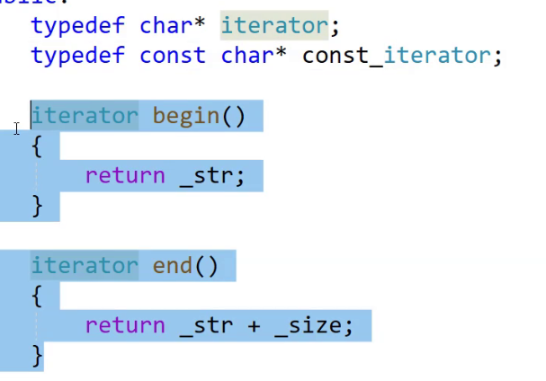

空格和换行都不作为字符输入，导致char类型的ch无法拿到空格进行结束判断

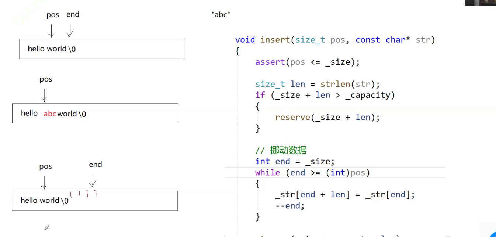

strstr

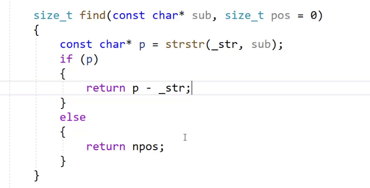

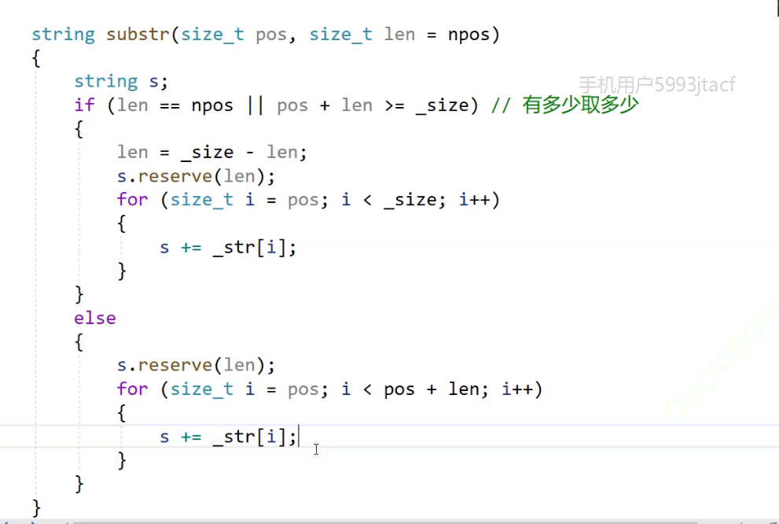

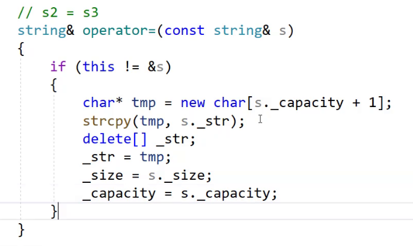

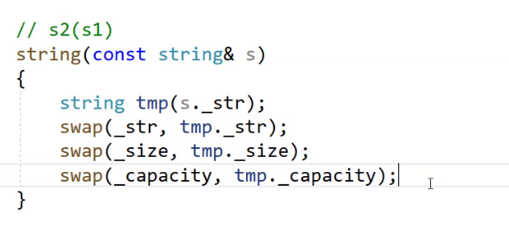

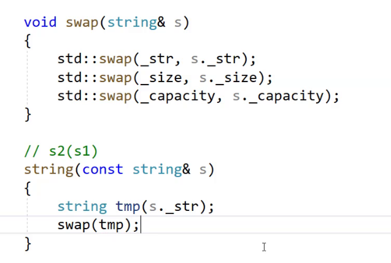

提前对内置类型处理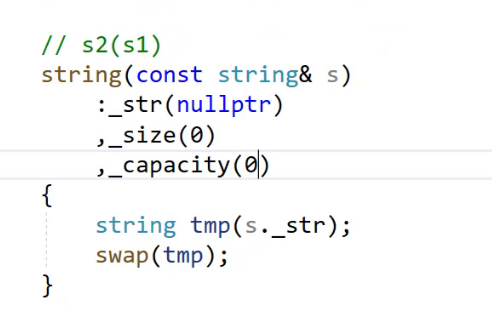

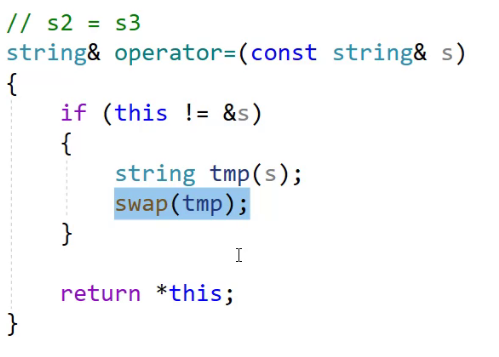

交换后tmp指向的是this指向的空间，而出作用域后tmp析构，将之前this交换之前的空间销毁，同时this指向新空间

就是delete[] _str

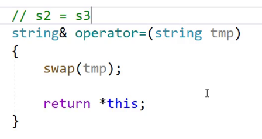

更加极致，在传参的过程中，调用拷贝构造，然后交换空间，析构函数销毁tmp

流插入，减少开空间的次数

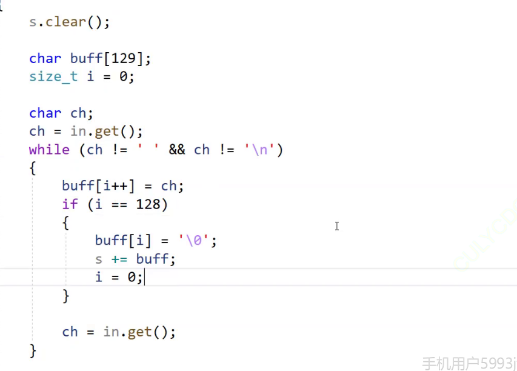

每次字符大于128时插入一次

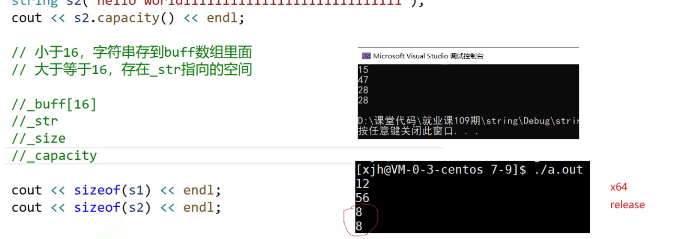

防止内存碎片

引用计数

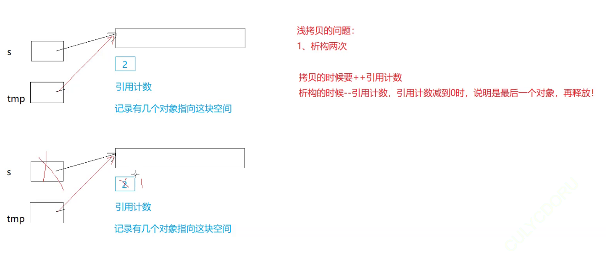

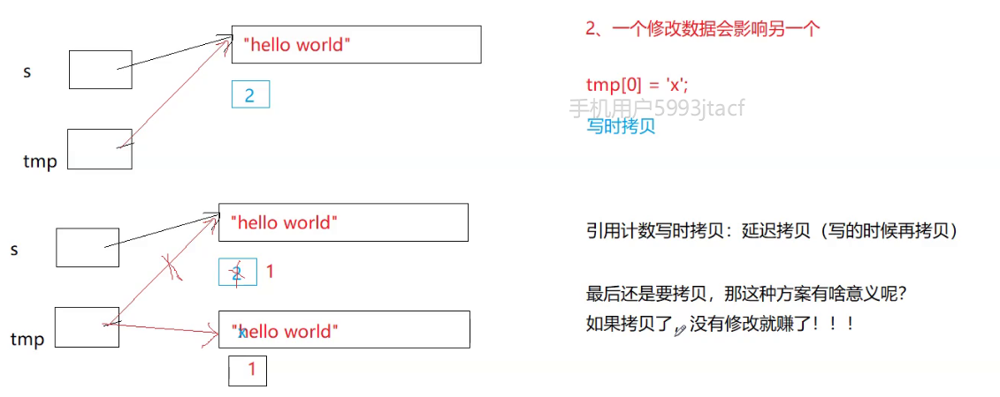

vs下是 深拷贝

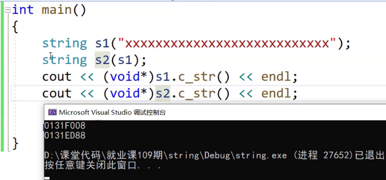

g++下是浅拷贝

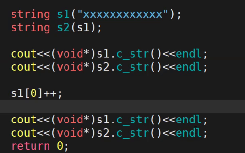

浅拷贝后对字符串进行写时拷贝

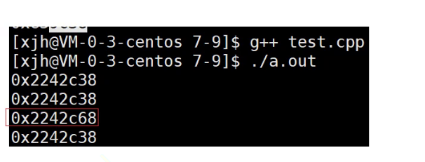

编译器就会进行浅拷贝

