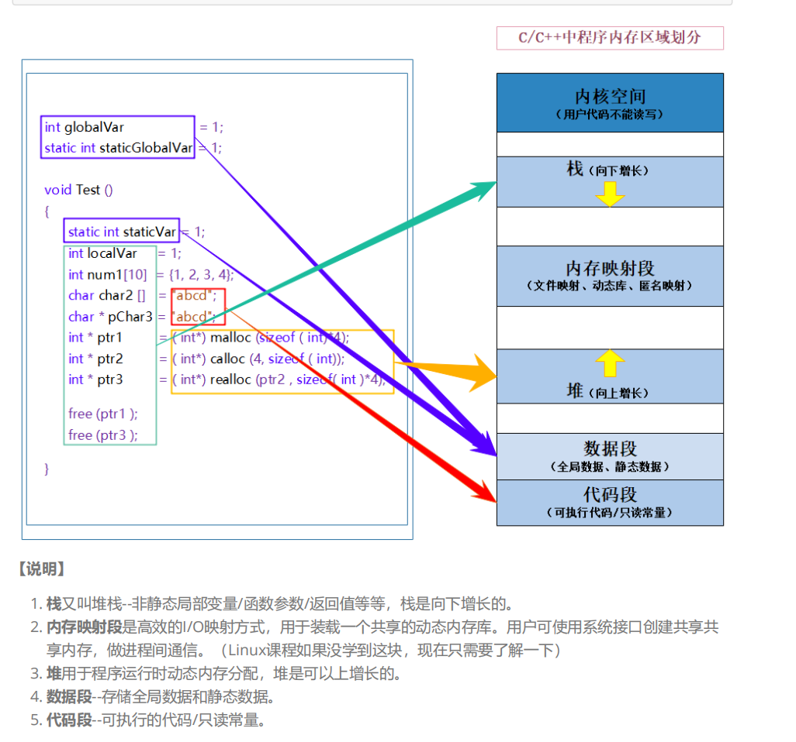
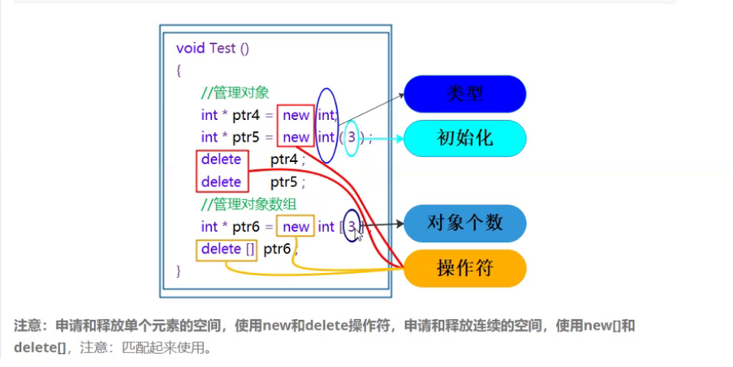
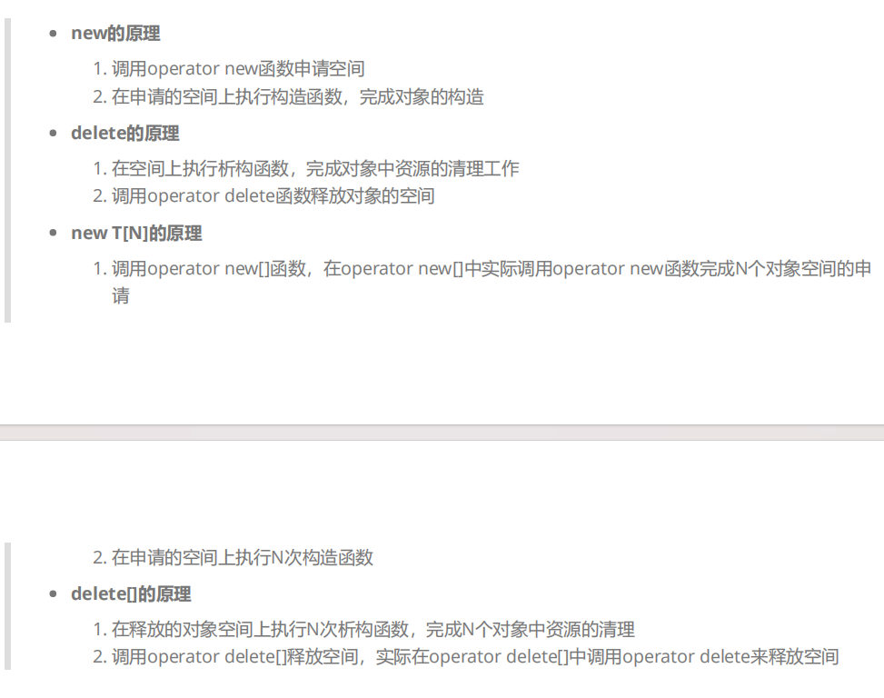
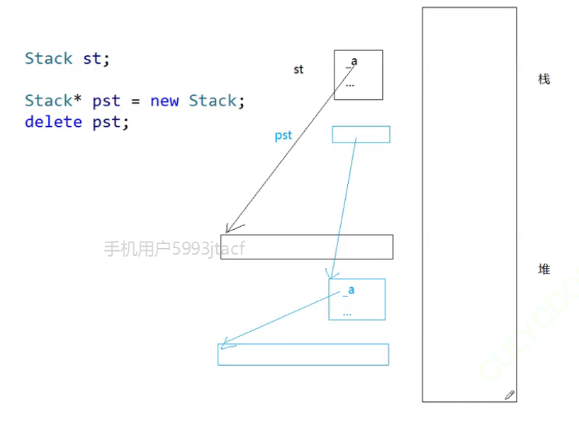
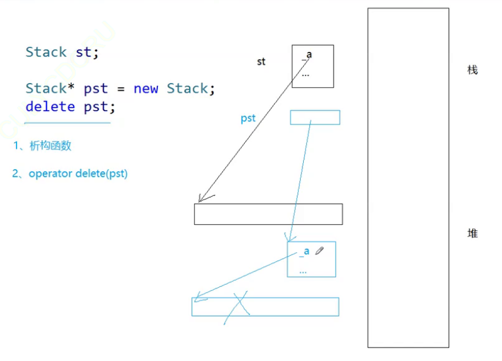
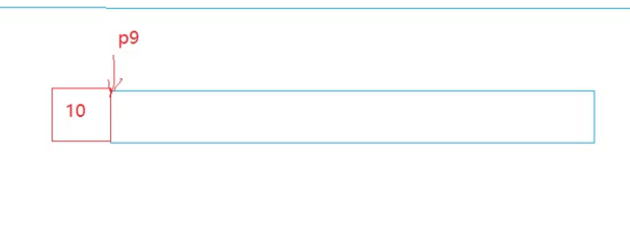
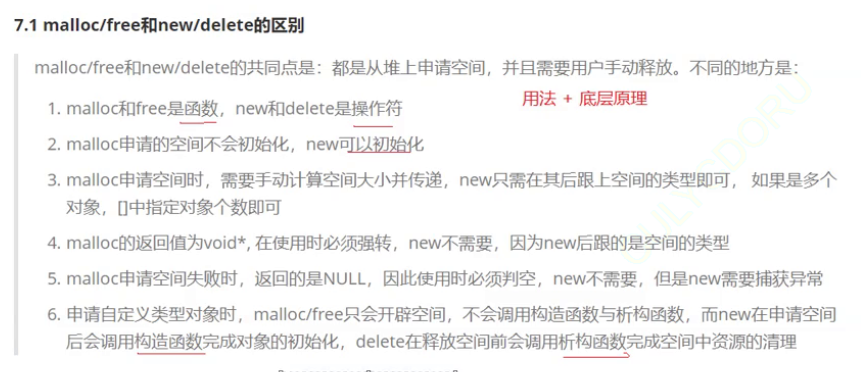
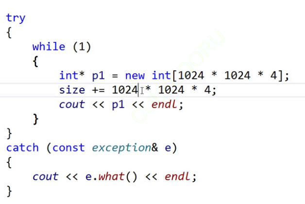
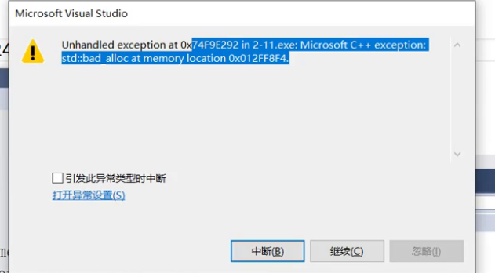
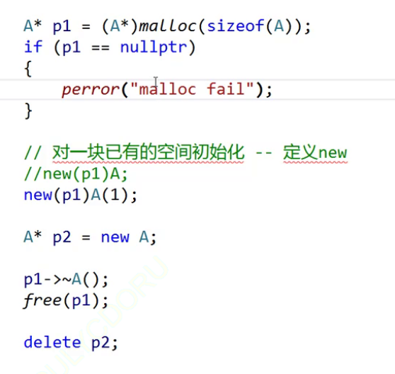

# 动态内存管理

```c++
int globalVar = 1;
static int staticGlobalVar = 1;
void Test()
{
static int staticVar = 1;
int localVar = 1;
int num1[10] = { 1, 2, 3, 4 };
char char2[] = "abcd";
const char* pChar3 = "abcd";
int* ptr1 = (int*)malloc(sizeof(int) * 4);
int* ptr2 = (int*)calloc(4, sizeof(int));
int* ptr3 = (int*)realloc(ptr2, sizeof(int) * 4);
free(ptr1);
free(ptr3);
}
```




# new/delete

```c++
#include<iostream>    
#include<cstdlib>                                                                                                                                     
using namespace std;                     
                                         
int main()                               
{                                        
    int *ptr1=new int;//不会初始化
    //int *ptr1=new int(0);//初始化；初始化为0
    //int *ptr1=new int[10]{1,2,3,4,5,6,7,8,9,0};//初始化数组
                                            
    int* ptr2=(int*)malloc(sizeof(int));    
                                         
                                         
    cout<<*ptr1<<" "<<*ptr2;             
                                         
    return 0;                                                                                                       
}   
```

相同代码在gcc  0  0

与vs2022-842150451 -842150451（随机值）

但是这并不能说明 new  与malloc 可以将对象初始化成0（规范中 ，两位都不要求初始化为零）

与delete匹配使用，不要混用，可能会出问题



# operator new和operator delete

库函数不是重载函数

```c++
void* __CRTDECL operator new(size_t size) _THROW1(_STD bad_alloc)
{
    // try to allocate size bytes
    void* p;
    while ((p = malloc(size)) == 0)
        if (_callnewh(size) == 0)
        {
            // report no memory
            // 如果申请内存失败了，这里会抛出bad_alloc 类型异常
            static const std::bad_alloc nomem;
            _RAISE(nomem);
        }
    return (p);
}
```

```c++
void operator delete(void* pUserData)
{
    _CrtMemBlockHeader* pHead;
    RTCCALLBACK(_RTC_Free_hook, (pUserData, 0));
    if (pUserData == NULL)
        return;
    _mlock(_HEAP_LOCK); /* block other threads */c++
        __TRY
        /* get a pointer to memory block header */
        pHead = pHdr(pUserData);
    /* verify block type */
    _ASSERTE(_BLOCK_TYPE_IS_VALID(pHead->nBlockUse));
    _free_dbg(pUserData, pHead->nBlockUse);
    __FINALLY
        _munlock(_HEAP_LOCK); /* release other threads */
    __END_TRY_FINALLY
        return;
}
```



指针都是内置类型





**不正确使用delete与free会造成内存泄漏！！**

## 会报错的场景

```c++
A* ptr = new A[10];
free(A);//报错
delete A//报错
delete[] A
```



  vs编译器 对于new开的空间（ A* ptr = new A[10];）会多开4字节空间用于存储N（10），告诉operator delete[]调用析构函数的次数，然后指针向前偏移到多开空间的起始地址进行free

# 区别



# 失败



try  catch 获得失败原因

## new



失败弹 弹窗  -> 抛异常！ 

malloc

返回空

# 对已有的空间初始化--定义new


（）内是传参



对于自定义类，使用new最好，但是如果对象是内存池内的（已经申请过的内存，不需要多次申请，提高效率）


