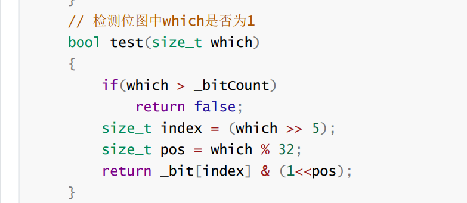

# 哈希表

单向迭代器              都有multi 版本允许键值冗余

## unordered_set

底层是哈希，所有并不是有序

## unordered_map

功能与set map都是一样的，除了不排序，单向

## 去重

 

## 哈希结构

 

我们同时可以尝试，如果节点数量达到一定长度，可以转换成红黑树

但是无法区分字符顺序，所以：（尽可能避免冲突）

[各种字符串Hash函数 - clq - 博客园 (cnblogs.com)](https://www.cnblogs.com/-clq/archive/2012/05/31/2528153.html)

# 素数作为扩容大小（不是很靠谱）

**左移都是向高位移动（大段机，小端机）**

左低右高

  

 

优先级

如何开42亿空间size_t

也可以使用两个位图，第一个表示在或者不在，第二个位图表示在第一个基础上还有没有相同的也就是  2个及以上

**整数最多就只有42亿9千万个，所以100亿跟42亿没区别**

**布隆过滤器**

只是降低概率，也无法准确判断在，

 

**3个不同的仿函数确定映射的3个位置**

false是准确的 true是不准确的

布隆过滤器一般服务对象就是string 整形就去使用bitset了，这个还不准确

 BloomFilter

## 哈希切分

因为文件内存够小，可以存进内存，而且相同的ip一定在一个文件内，可以进行统计次数
