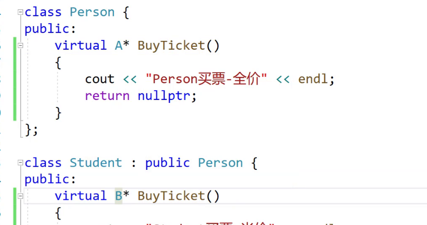
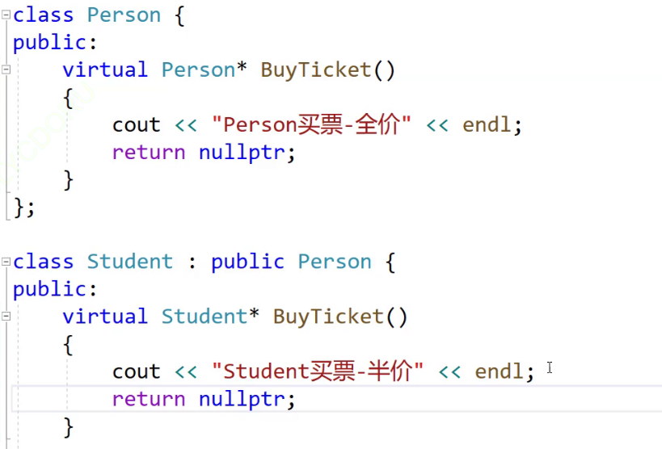
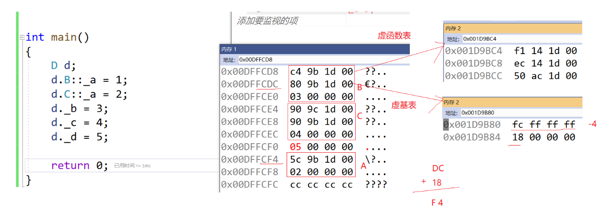

# 多态

## 虚函数重写

**继承关系父子的两个虚函数，函数名，参数类型，返回值都相同才构成虚函数重写**

virtual只能修饰成员函数，用来构成多态

例外1：**协变：返回值可以不同，但返回值必须是父类或者子类的指针或者引用**，其他类也是可以的

例外2：子类虚函数重写可以不加virtual  （派生类）ps：建议加上

由于特殊处理，析构函数在被处理后，函数名相同，父类加上virtual就可以正确调用，防止内存泄漏！  

ps：p先是指向基类 后被赋值为基类   可以赋值的原因是他们是基类和派生类，由于指针并不会对不同的类进行处理，将导致，后面析构的时候，delete不会对派生类进行特殊处理而是直接调用基类析构函数

虚函数的重写，继承的是接口，重写实现

 只有构成多态的时候，才是使用父类的接口，不构成多态的时候只是正常调用（父类的指针或者引用去调用）

# final

#  override

# 抽象类

比如 动物类 无法实例出对象，但是可以让 例如 马类去继承 去实例化 马 而动物类具有的虚函数也就是 马 这个类必须重写或者是必须拥有这个虚函数 从而实现派生类之间的多态

只要有虚函数，就会有虚函数表 存放指针

# 多态的原理 

 父类指针接收子类地址后，**会切割**，但是子类的虚函数表内指向的地址已经改变，而父类指向的虚函数表内地址并未改变，也就造成了多态

多态调用会在虚函数表里去找到需要调用的函数地址，但是普通调用就直接确定调用地址

 

如果子类没有重写父类虚函数，虚表也不一样

同一个类的对象共用一个虚表

虚表所在位置：

成员函数找地址需要指定类域和取地址符 &  普通函数则不用

**也就是说，虚表存储在代码段（常量区）**

**所有虚函数一定都会被存放在虚表里！！**

函数指针定义

指针类型之间都可以互相强制转换

&d是类的地址，我们只需要前4个字节获得虚表地址，

64位环境下 int *  是8个字节   long long*  也是8个字节，但是可能发生了截断

切片 直接获得base2的部分

继承的父类共有几个虚表就有几个虚表，单独的虚函数就放到第一张虚表

derive重写了两个func1（）但是这个函数在两张虚表中地址并不一样 （最终调用的是同一个函数） 

sub ecx 8  重新调整this指针的指向

 **看不懂：：**

### 内联函数在普通调用的时候有内联的作用，多态调用的时候就不具备这个功能了

# 总结

