# 智能指针

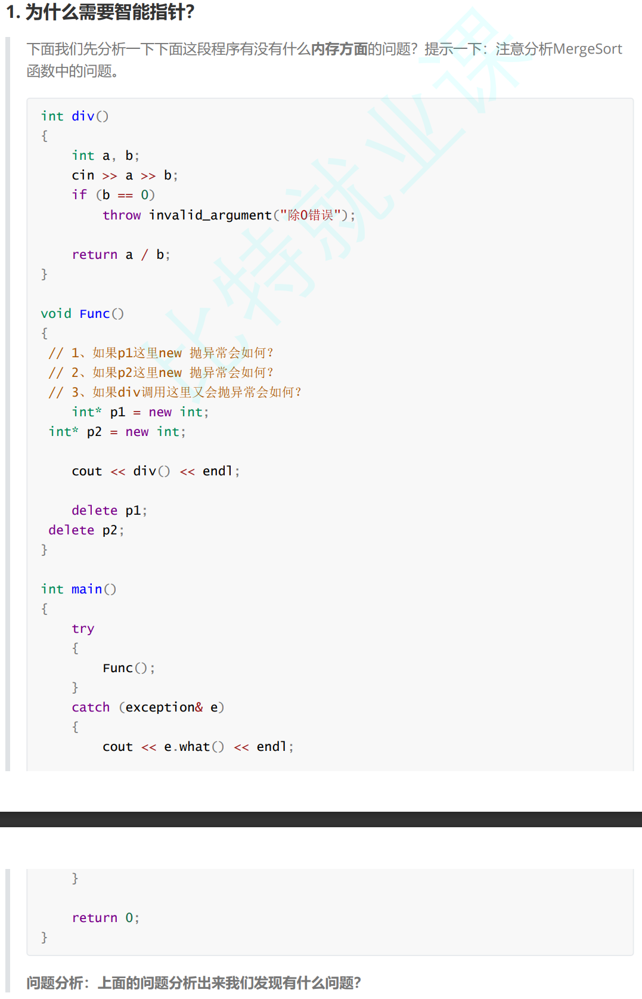

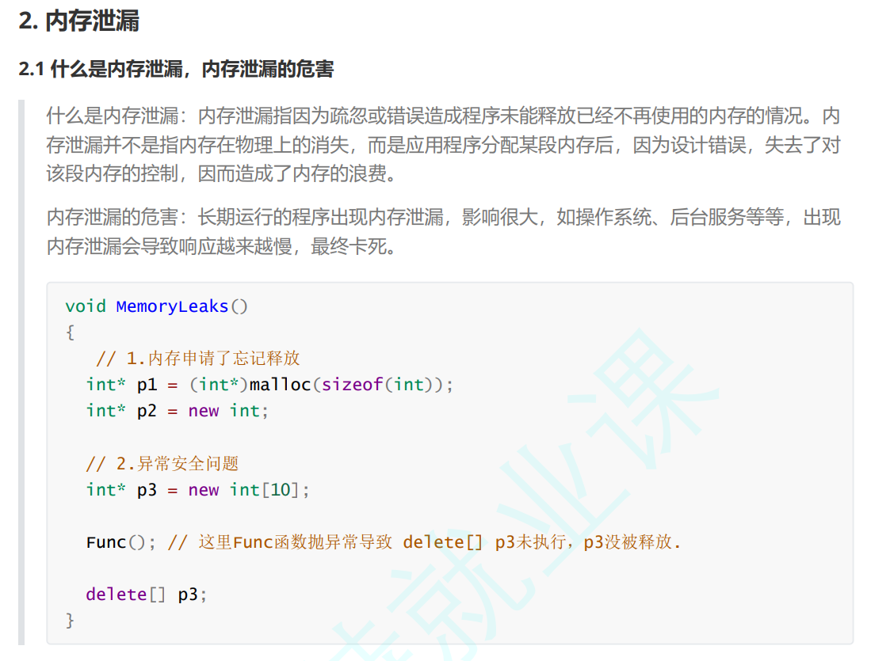

## 智能指针

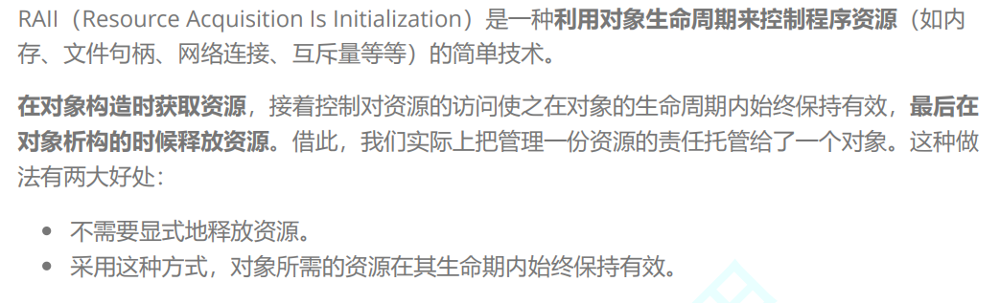

 

```C++
// 使用RAII思想设计的SmartPtr类
template<class T>
class SmartPtr {
public:
    SmartPtr(T* ptr = nullptr)
       : _ptr(ptr)
   {}
    ~SmartPtr()
   {
        if(_ptr)
            delete _ptr;
   }
    
private:
    T* _ptr;
};

```

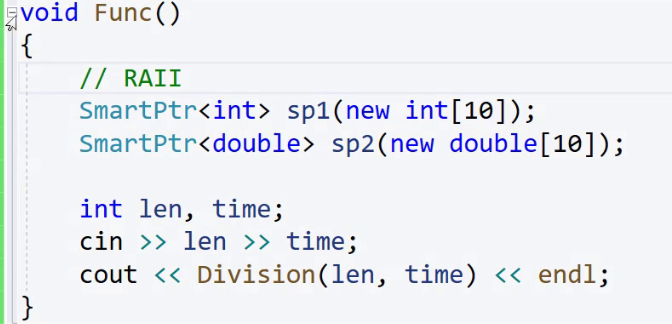

在其声明周期正常使用，如果遇到异常，跳过生命周期所在的范围，自动调用析构释放

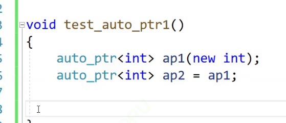

系统自动生成浅拷贝，导致析构两次同一块空间，这里的拷贝就很奇怪，在list vector 中，深拷贝都是相同的内容，不同的空间，但是指针的内容就是空间地址，这样就导致了很多版本的智能指针的实现

## auto_ptr

C++98 

管理权转移

```C++
auto_ptr<T>& operator=(auto_ptr<T>& ap)
{
    // 检测是否为自己给自己赋值
    if (this != &ap)
    {
        // 释放当前对象中资源
        if (_ptr)
            delete _ptr;
        // 转移ap中资源到当前对象中
        _ptr = ap._ptr;
        ap._ptr = NULL;
    }
    return *this;
}

```

但是如果不熟悉（auto_ptr）智能指针的使用，就会访问管理权转移后的对a象，导致空指针，很不合理

## unique_ptr

C++11 

防拷贝

直接使用delete（C++ 11） 关键字禁止拷贝，

```c++
unique_ptr(const unique_ptr<T>& sp) = delete;
unique_ptr<T>& operator=(const unique_ptr<T>& sp) = delete;

```

C++ 98  

把这两个函数实现在 private 里   只声明不实现（写在public里可以在类外实现，也有问题）

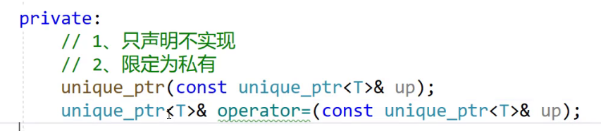

## shared_ptr

引用计数

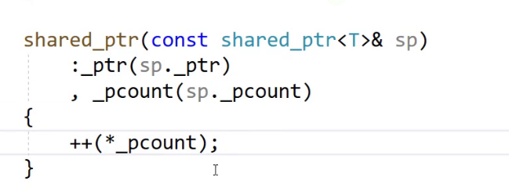

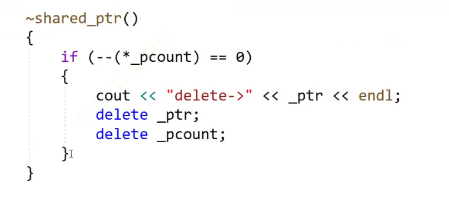

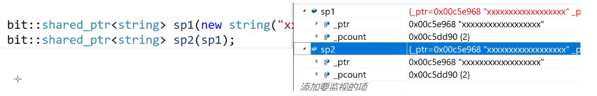

```C++
 SmartPtr<T>& operator=(const SmartPtr<T>& sp)
 {
     if (_ptr != sp._ptr)
     {
         //删除之前数据
         release();

         _ptr = sp._ptr;
         _pcount = sp._pcount;
         //*(sp._pcount)++;
         *_pcount++:
     }

     return *this;
 }
```

如果不判断，把自己删了，就空指针了

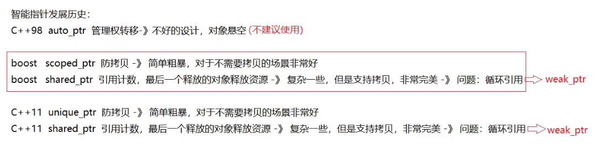

## 循环引用

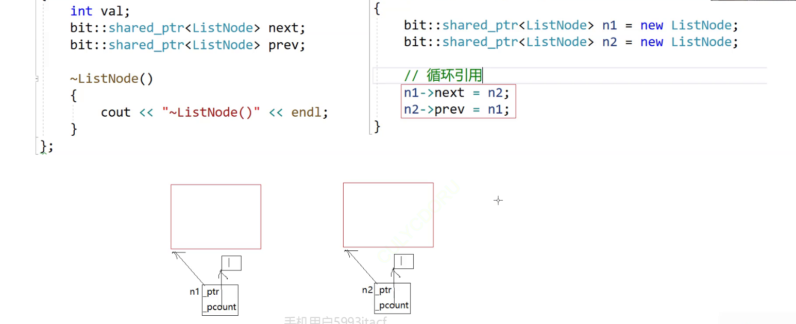

 

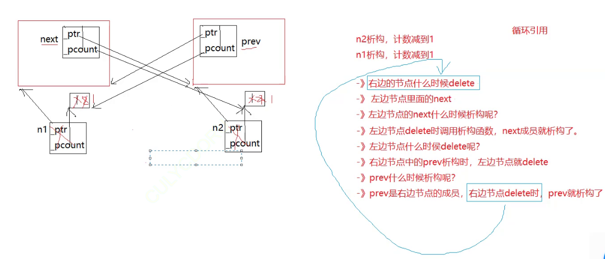

weak_ptr 不增加share的计数


```c++
template<class T>
    class weak_ptr
    {
     public:
        weak_ptr()
            :_ptr(nullptr)
            {}
        weak_ptr(const shared_ptr<T>& sp)
            :_ptr(sp.get())
            {}
        weak_ptr<T>& operator=(const shared_ptr<T>& sp)
        {
            _ptr = sp.get();
            return *this;
        }
        T& operator*()
        {
            return *_ptr;
        }
        T* operator->()
        {
            return _ptr;
        }
      private:
        T* _ptr;
    };
}

```

weak_ptr  也有引用计数  如果weak_ptr 指向一块shared_ptr  的空间，但是不会增加引用计数， shared_ptr  析构后 weak_ptr就没了 需要weak_ptr 计数，解决这个问题

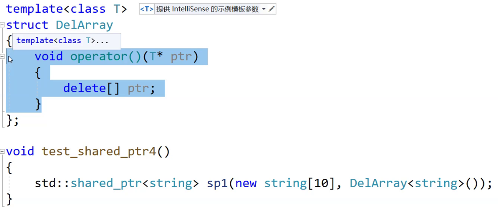

处理不同类型的数据   

### 定制删除器

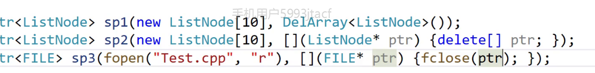

使用lambda

包装器接收可调用对象

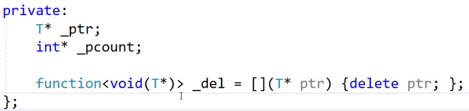
