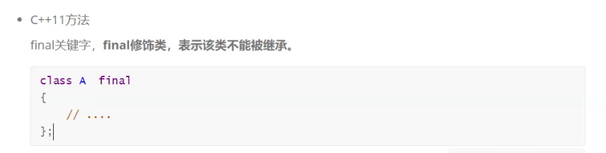

# 特殊类设计

## 只能在堆上创建对象

```C++
// 请设计一个类，只能在堆上创建对象
class HeapOnly
{
public:
	/*static void Destroy(HeapOnly* ptr)
	{
		delete ptr;
	}*/

	void Destroy()
	{
		delete this;
	}
private:
	// 方案一：析构函数私有化
	// 方案二：构造函数私有化
	~HeapOnly()
	{
		cout << "~HeapOnly()" << endl;
	}
};

int main()
{
	//HeapOnly hp1;
	//static HeapOnly hp2;
	HeapOnly* ptr = new HeapOnly;
	//delete ptr;
	//HeapOnly::Destroy(ptr);
	ptr->Destroy();
		
	return 0;
}


```

```c++
class HeapOnly
{
public:
	static HeapOnly* CreateObj()
	{
		return new HeapOnly;
	}

    //防止使用编译器自动生成的拷贝构造
	HeapOnly(const HeapOnly& hp) = delete;
private:
	// 方案一：析构函数私有化
	// 方案二：构造函数私有化
	HeapOnly()
	{
		cout << "HeapOnly()" << endl;
	}
};

int main()
{
	//HeapOnly hp1;
	//static HeapOnly hp2;
	HeapOnly* ptr = HeapOnly::CreateObj();
	//HeapOnly copy(*ptr);

	return 0;
}
```


## 设计一个类，只能在栈上创建

```C++
class StackOnly
{
public:
	static StackOnly CreateObj()
	{
		StackOnly obj;
		return obj;
	}

	//自己得拷贝，返回时拷贝，会调用系统生成的这个函数
	//StackOnly(const StackOnly&) = delete;

	void* operator new(size_t size) = delete;

	// 实现类专属的operator new
	// new这个类对象时，operator new就会调用这个，不会调全局的
	/*void* operator new(size_t size)
	{
		cout << "void* operator new(size_t size)" << endl;
		return malloc(size);
	}*/
private:
	StackOnly()
	{
		cout << "StackOnly()" << endl;
	}
};
```

```C++
int main()
{
	StackOnly obj = StackOnly::CreateObj();
	//StackOnly* ptr = new StackOnly;

	//StackOnly* ptr = new StackOnly(obj);

	//int i = (int)obj;

	return 0;
}
```

## 类不能被继承

 构造函私有化    使用关键字 final

