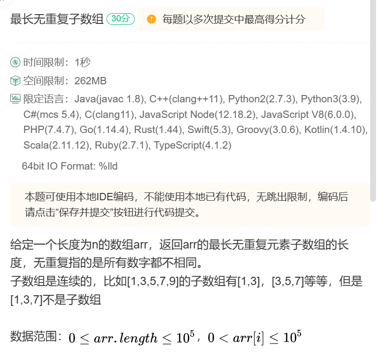

# 笔试强训 Day-13

## 重排字符串


我们只需要获取长度最长的最符串，他的长度如果大于所有字符串长度之和+1 这就不可能存在 不相邻的字符串组合，

```C++
#include <iostream>
using namespace std;
#include <iostream>
#include <unordered_map>
#include <string>
#include <algorithm>

pair<char, char> find_max_and_second_max(const unordered_map<char, int>& map) {
    char max_char = '\0', second_max_char = '\0';
    int max_value = -1;
    int second_max_value = -1;

    for (const auto& kv : map) {
        if (kv.second > max_value) {
            second_max_value = max_value;
            second_max_char = max_char;
            max_value = kv.second;
            max_char = kv.first;
        } else if (kv.second > second_max_value && kv.second < max_value) {
            second_max_value = kv.second;
            second_max_char = kv.first;
        }
    }

    return { max_char, second_max_char };
}

bool yes_or_on(const unordered_map<char, int>& map) {
    int length = 0;
    int Max = 0;
    for (auto& e : map) {
        Max = max(e.second, Max);
        length += e.second;
    }
    length -= Max;

    return length + 1 >= Max;
}


int main() {
    int a;
    cin>>a;
    string str;
    cin>>str;
    sort(str.begin(), str.end());
    unordered_map<char, int> M;

    for (auto& e : str) {
        M[e]++;
    }

    if (!yes_or_on(M)) {
        cout << "no" << endl;
        return 0;
    }

    string _str;

    while (!M.empty()) {
        pair<char, char> S = find_max_and_second_max(M);

        if (S.first != '\0') {
            _str += S.first;
            M[S.first] -= 1;
            if (M[S.first] == 0) {
                M.erase(S.first);
            }
        }

        if (S.second != '\0') {
            _str += S.second;
            M[S.second] -= 1;
            if (M[S.second] == 0) {
                M.erase(S.second);
            }
        }
    }

    cout<<"yes"<<endl;
    cout << _str << endl;


    return 0;
}
```

## 最长无重复子数组



**需要注意，我使用哈希表映射后，滑动窗口移动后，哈希表同时也需要判断后面在哈希表内的元素是不是处于当前滑动窗口下**

```C++
int maxLength(vector<int>& arr) {
    // write code here

    unordered_map<int, int>  Map;

    int distance = 1;
    //Map[arr[0]];
    int right = 0;
    int left = 0;
    while (right < arr.size()) {

        if (Map.count(arr[right]) && Map[arr[right]] >= left) {
            left = Map[arr[right]] + 1;
        }

        distance = max(distance, right - left + 1);
        Map[arr[right]] = right;
        right++;
    }
    return distance;
}
```

