# 类型转换

## C语言中的转换

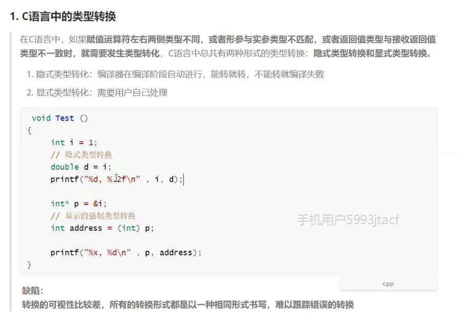

相近类型才可以转换

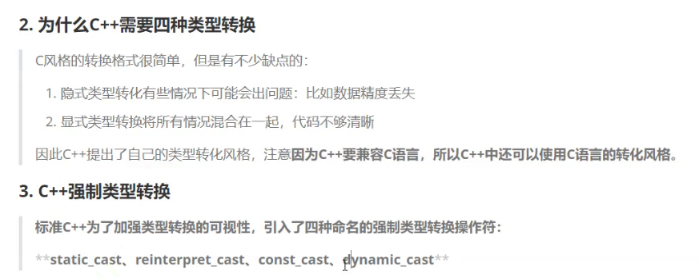

### static_cast

 相近类型使用 static_cast   ->隐式类型转换

  意义相近的类型

```c++
double b=12.34;
int a=static_cast<int>(b);
```

### reinterpret_cast

意义不相同的类型使用 reinterpret_cast

```c++
int * ptr=reinterpret_cast<int*>(a);
```

### const_cast

```c++
int* p = const_cast<int*>(&a);
int* p = (int*)&a;
*p = 3;
```

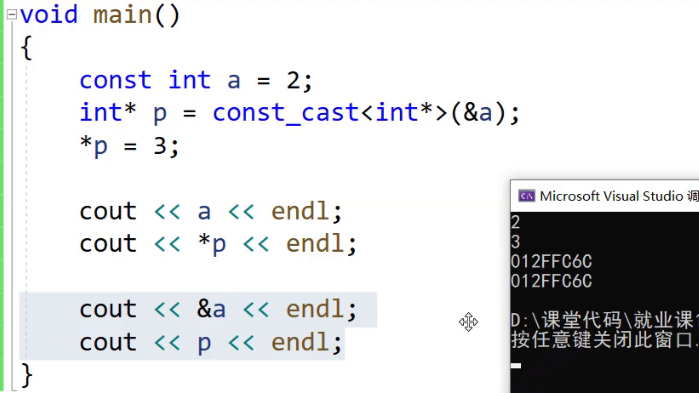

const 修饰的对象 编译器认为他不会修改 就类使用宏一样，直接替代 如果不想要编译器优化，关键字 **volatile**

```c++
volatile const int a=1;
```

但会出现其他的问题

没有**volatile** 直接push 2

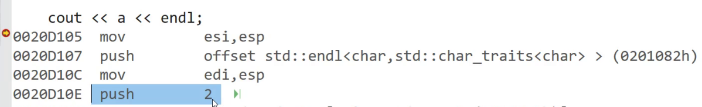

这几个关键字，只是为了好读   **隐式类型转换很危险**

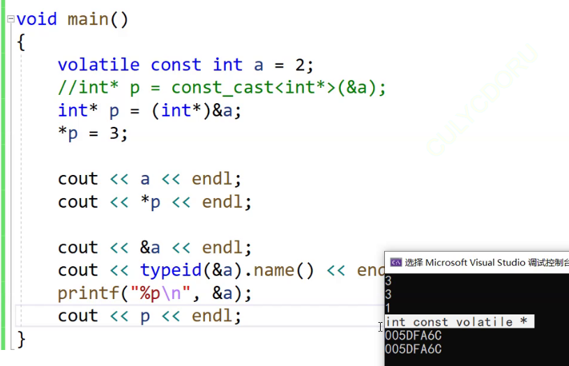

没有匹配到一个很好的 cout输出函数 

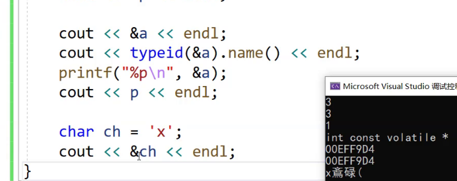

### dynamic_cast

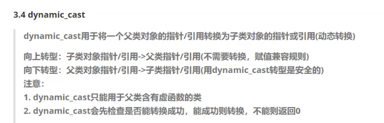

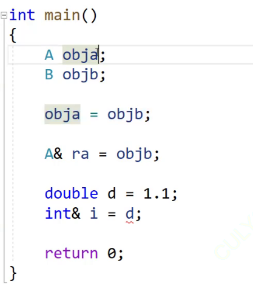

类型转换会产生临时变量（具有常性）引用无法引用

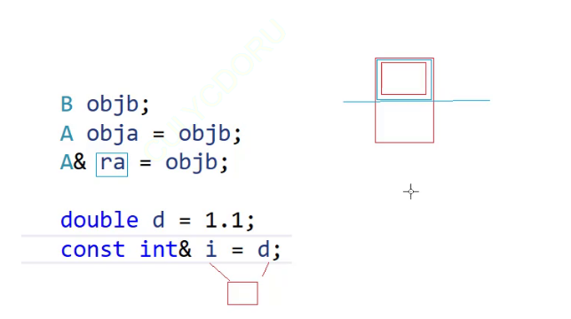

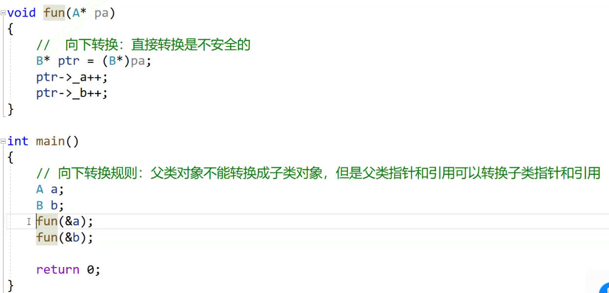

 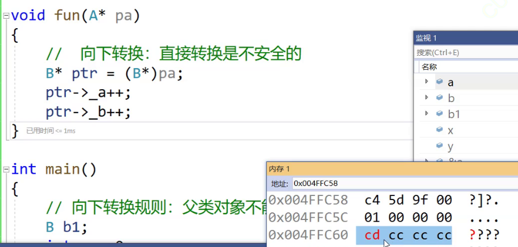

对不属于自己的空间进行的修改  越界（本身就是指向父类的）

```C++
void fun(A* pa)
{
	//  向下转换：直接转换是不安全的
	// 如果pa是指向父类A对象，存在越界问题
	B* ptr = dynamic_cast<B*>(pa);
	if (ptr)
	{
		ptr->_a++;
		ptr->_b++;
	}
	else
	{
		cout << "转换失败" << endl;
	}
}
//  子类 -> 父类 ->  子类   不存在越界
//  父类 -> 父类 ->  子类   会越界
```

dynamic_cast

父类必须有虚函数（多态）

## 运行时 类型识别

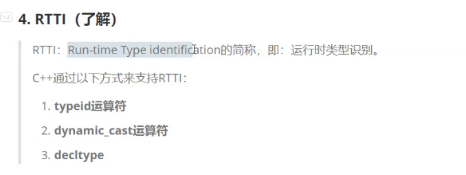

ps：   **哪几种转换**  重点