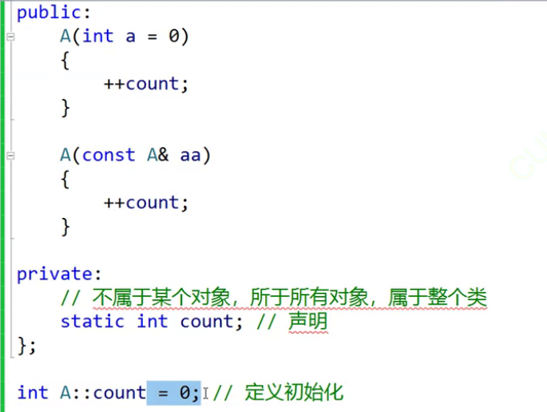
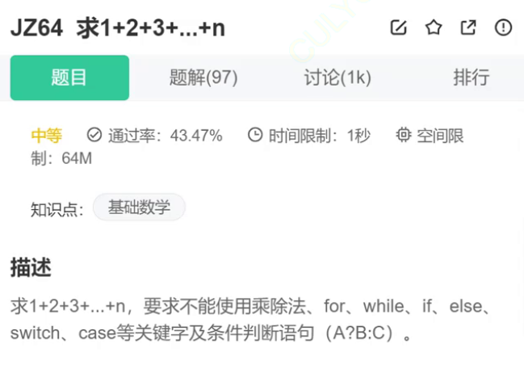
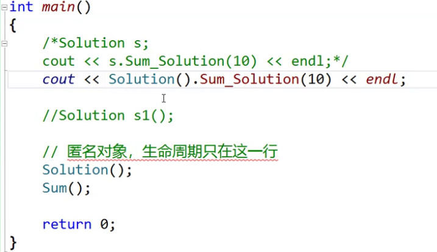
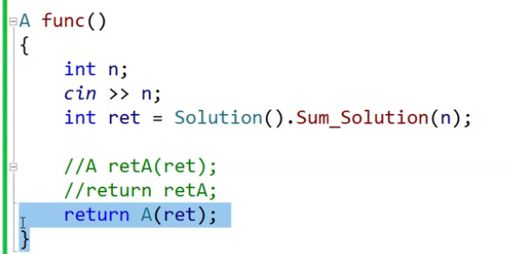
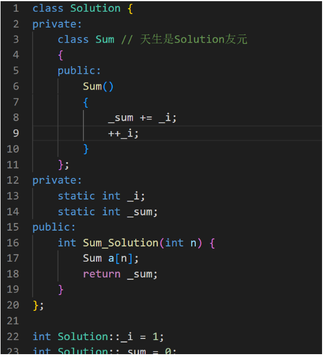
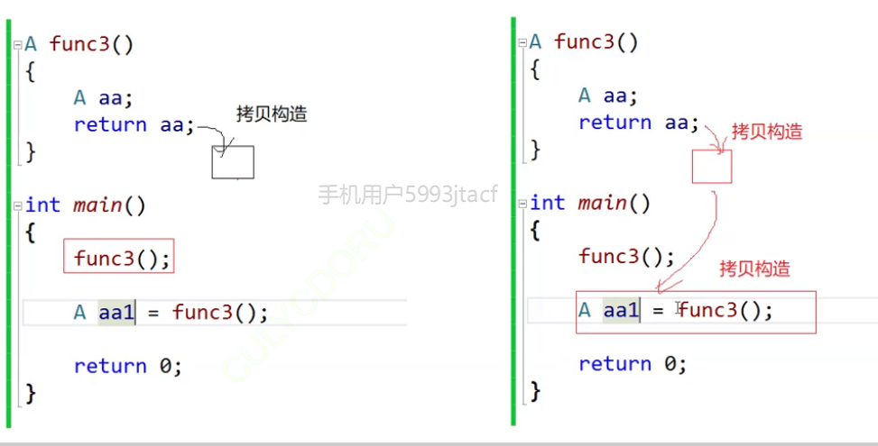
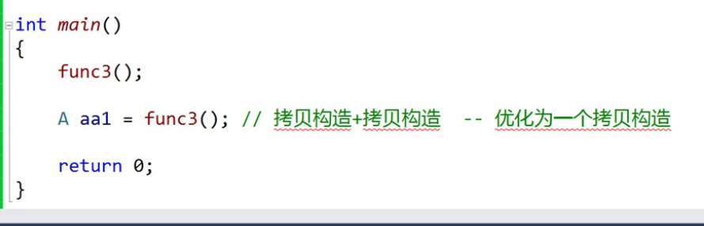
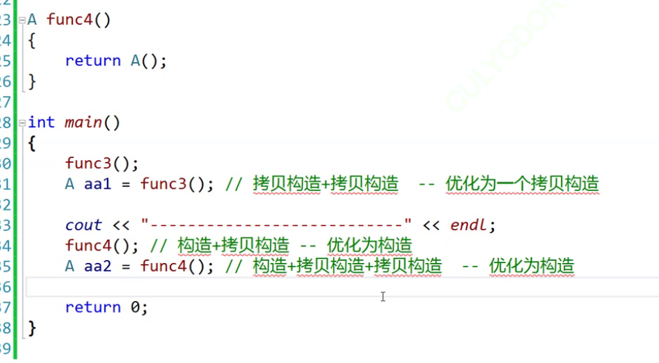
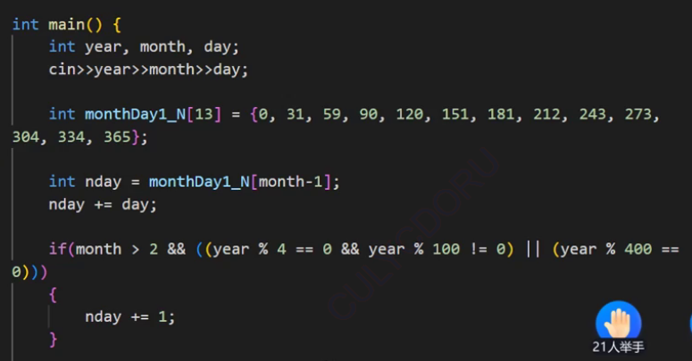

# 隐式转换

```C++
// 单参数的构造函数
class A
{
public:
	explicit A(int a)
		:_a1(a)
	{
		cout << "A(int a)" << endl;
	}

	//explicit A(int a1, int a2)
	A(int a1, int a2)
		:_a1(a1)
		, _a2(a2)
	{}

	A(const A& aa)//拷贝构造也有初始化列表（构造都可以用初始化列表）
		:_a1(aa._a1)
	{
		cout << "A(const A& aa)" << endl;
	}

private:
	int _a2;
	int _a1;
};

int main()
{
	// 单参数构造函数 C++98
	A aa1(1);  // 构造函数
	//A aa2 = 1; // 隐式类型转换   构造+拷贝+优化->构造//编译器的优化
	//const A& ref = 10;


	// 多参数构造函数 C++11
	A aa2(1, 1);
	A aa3 = { 2, 2 };
	const A &ref = { 2, 2 };

	int i = 1;
	double d = i; // 隐式类型转换

	return 0;
}

```

explicit不允许发生隐式类型转换，

对于const

在C++中，你不能将一个整数直接赋值给一个常量引用，因为整数10是一个临时值，而临时值不能绑定到非const的引用。但是，你可以通过创建一个const引用来绑定到临时值，如下所示：

```cpp
const int& ref = 10;
```

这样做是合法的，因为引用是常量引用，意味着它是不可修改的，而且它引用的是一个常量。在这种情况下，10是一个临时值，但是通过const引用，你可以安全地访问它。

## 静态成员  static

计算一个类，在程序中创建出多少个类



静态成员初始化是在类外初始化

```c++
class A
{
public:
 A() { ++_scount; }
 A(const A& t) { ++_scount; }
 ~A() { --_scount; }
 static int GetACount() { return _scount; }
private:c++
 static int _scount;
};
int A::_scount = 0;
void TestA()c++
 cout << A::GetACount() << endl;
 A a1, a2;
 A a3(a1);
 cout << A::GetACount() << endl;
}
```

```c++
//	//cout << A::count << endl;
//	//cout << aa2.count << endl;
//	//cout << aa3.count << endl;
//	//A* ptr = nullptr;
//	//cout << ptr->count << endl;
```

静态成员变量属于所有类

```c++
static int getcount()
{
    return count;
}
```

静态成员函数没有this指针，属于所有对象，不能直接访问非静态成员

自定义类型的数组会自动使用构造函数初始化




Sum a[n]  n次调用构造函数（变长数组）

```c++
Sum* ptr=new Sum[n]
```

# 匿名对象

```c++
//Solution s1();
Solution();
Sum();
```

生命周期只在一行 



简易调用函数



使用匿名对象返回

# 友元

好友关系是单向的

## 友元函数

友元增加契合度，但是会破坏封装，没有this指针

```c++
class Date
{
	//友元声明
	friend ostream& operator<<(ostream& out, const Date& d);//减少拷贝
	friend istream& operator>>(istream& out, Date& d);//不要const 
//内联函数
}

inline ostream& operator<<(ostream& out, const Date& d)//减少拷贝
{
	out << d._year << "\\" << d._month << "\\" << d._day;
	out << endl;

	return out;
}

inline istream& operator>>(istream& in, Date& d)//不要const 
{
	in >> d._year >> d._month >> d._day;

	return in;
}
```

## 友元类

```c++
class Time
{
 friend class Date; // 声明日期类为时间类的友元类，则在日期类中就直接访问Time类中的私有成
员变量
public:
 Time(int hour = 0, int minute = 0, int second = 0)
 : _hour(hour)
 , _minute(minute)
 , _second(second)
 {}
 
private:
 int _hour;
 int _minute;
 int _second;
};
class Date
{
public:
 Date(int year = 1900, int month = 1, int day = 1)
 : _year(year)
 , _month(month)
 , _day(day)
 {}
 
 void SetTimeOfDate(int hour, int minute, int second)
 {
 // 直接访问时间类私有的成员变量
 _t._hour = hour;
 _t._minute = minute;
 _t._second = second;
 }
 
private:
 int _year;
 int _month;
 int _day;
 Time _t;
};
```


# 内部类

```c++
class A
{
    private:
    int h=1;
    public:
    class B//内部类 --与A独立，只是受A类域的限制
        //天生就是友元，外部类无法访问内部类，哈哈哈，单向关系
    {
        private:
        int b=2;
    };
};
```

```
A aa;
sizeof(aa)=4
```

\1. 内部类可以定义在外部类的public、protected、private都是可以的。

\2. 注意内部类可以直接访问外部类中的static成员，不需要外部类的对象/类名。

\3. sizeof(外部类)=外部类，和内部类没有任何关系。





编译器优化



返回时可以优先使用匿名对象



```c++
A fun()
{
    A aa;
    return aa;
}

A aa1=fun();//可以优化  将拷贝构造连在一起

A aa2;
aa2=fun()//无法优化  
```

尽量以拷贝构造的方式接收

函数中返回对象是，尽量返回匿名对象

函数传参 尽量使用 const  & 传参 




# 内存

```c++
int* p1=(int)malloc(sizeof(int));
int* p2=new int;

free(p1);
delete p2;

int* pp1=(int)malloc(sizeof(int)*10);
int* pp2=new int[10];

free(pp1);
delete[] pp2;
```

new作用不止简化 ，为了自定义类型, new对于自定义类型会调用默认构造函数，去初始化自定义类型

而malloc不会 delete也会调用析构函数
