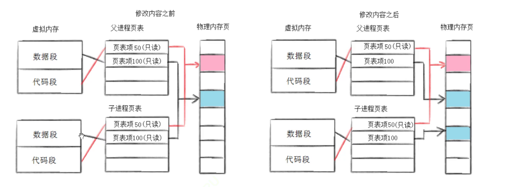
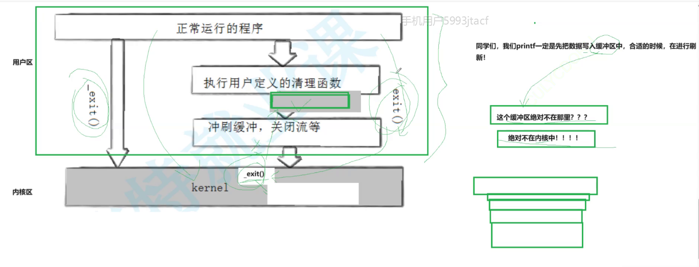

# 进程控制

**延迟申请，写诗拷贝，只拷贝需要修改的内存**

**父子进程执行顺序由调度器决定**

## 进程终止

### main return 值

**退出码**

**父进程通过main函数return返回值，拿到子进程退出码，来判断子进程的运行结束的结果**

### $ ?  

 

### strerror

系统错误码描述

ls 执行的返回错误，作为bash创建的子进程，其错误吗也会被父进程 bash捕获

这才是给人看的

自己写可以的

### errno

保存的最近的一次的错误码

获取最近的一次的错误码，我们可以将错误码与返回值结合，获取系统的错误码，让父进程也知道

### 代码异常终止

退出码在这时候是没有意义的，因为不知道代码实在哪里终止的

进程异常退出是因为受到了某些信号；

### exit

在main中

也是退出码

**在任意地方被掉用都代表进程退出**

**_exit**

_exit与exit的区别

**_exit直接终止，不会刷新缓冲器的信息**，因为_exit是系统调用接口，并不知道c语言那个用户级缓冲区的存在，也就不会刷新区

