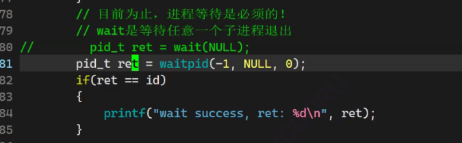
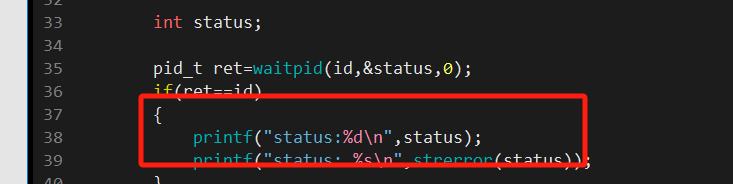
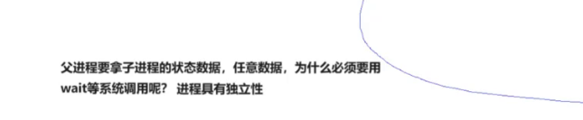

# 进程等待，替换

## wait waitpid

**等待成功返回子进程的pid**

**wait可以等待任意一个子进程退出，进行资源回收**

如果子进程不退出，父进程就会一直等待子进程退出在 wait 

**阻塞等待**

## 拿到子进程的退出信息

**ps ajx | head -1 && ps ajx | grep waittext | grep -v grep**

**通过waitpid wait 参数 int*  status 获得从子进程退出时的信息**

可以通过系统 strerror 获得相应的失败信息

### **status的构成**  

**但是为什么 status 按照整数输出，不是子程序exit（1）的 整数 1**

因为 status并不是按照整数的使用，而是将int 的32位分成几部分

数据从第二个 8  位开始存，前面都是0，也就是256

程序通过与各部分进行比较，来获得完整的退出状态

**将status的各个部分分开，获取**

就算父进程运行到 wait 子进程还没结束，父进程就会一直等待子进程退出

**进程等待只能等自己定义的进程，等待不对就会等待失败**

### 宏操作

获取status各部分的数据

**所有的进程只关心自己的子进程，孙子进程根本不关心**

### options

**父进程对子进程的等待方式**

#### 阻塞：

 参数：0

**一直卡在wait，阻塞等待子进程退出**

#### 非阻塞轮询：

参数：WNOHANG

**非阻塞 循环，可以执行自己的事情**

